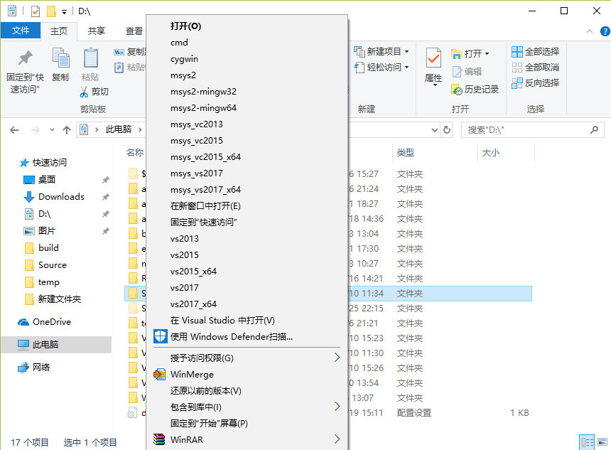

# Windows system right menu

Author: KangLin(kl222@126.com)

### [Detailed introduction](http://blog.csdn.net/kl222/article/details/7821322)

### Short screen

### Introduction

  - [right_menu.reg](right_menu.reg), All software is default installed.

  - [my_right_menu.reg](my_right_menu.reg), In addition to msvc, other software is installed D drive
    * msys、mingw is installed to D:/msys64 . so that, you may be change it to your directory of installed.
    * msvc 2013、2015、2017, There are default install. so that, you may ben't change it.

